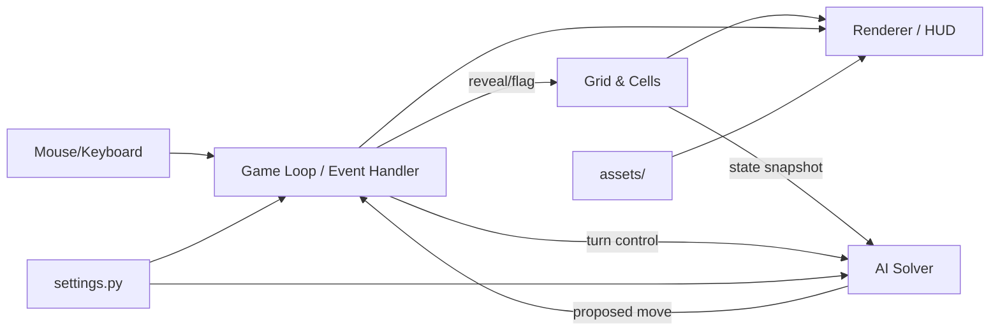
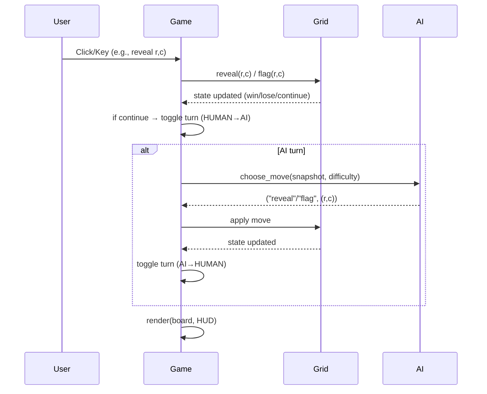

# System Architecture Overview 


## 1) Architecture at a Glance

The app follows a lightweight **MVC** split:

- **View/Controller (UI & Loop):** `main.py`, `game.py`  
  Handles window setup, input, frame updates, turn control (Human ↔ AI), and rendering hooks.
- **Model (Game State):** `grid.py`, `cell.py`  
  Owns board data, mine placement, hint computation, reveals/flags, win/lose checks.
- **AI (Co-op Partner):** `ai_solver.py`  
  Given a snapshot of the grid, returns the next safe/flagging move according to difficulty.
- **Config & Assets:** `settings.py`, `assets/`  
  Centralized gameplay constants (board size, mine count, delays) and fonts/sprites.

---

## 2) Data Flow Diagram


**Key idea:** The **Loop** owns orchestration: it forwards player input to the **Grid**, requests an AI move on AI turns, updates the **HUD**, and triggers **Render**.

---

## 3) Module Responsibilities

### `main.py` (entrypoint)
- Initialize Pygame/window.
- Instantiate `Game` with config from `settings.py`.
- Run the main loop: poll events → `game.update()` → `game.render()`.

### `game.py` (controller + rendering)
- **Turn Management:** `current_turn ∈ {HUMAN, AI}`; toggle after a successful move.
- **Input Handling:** Map clicks/keys to reveal/flag actions; ignore illegal actions.
- **AI Invocation:** When `current_turn == AI`, call `ai_solver.choose_move(...)` and apply result.
- **Rendering/HUD:** Board tiles, flags, numbers; co-op indicators (whose turn, difficulty).
- **End-States:** Detect win/lose via `grid.is_win()` / `grid.is_lose()` and show dialogs.

### `grid.py` (game state & rules)
- 2D matrix of `Cell` objects; lazy or seeded mine placement after first click (if implemented).
- **Core methods (typical):**
  - `neighbors(r, c) -> list[(nr, nc)]`
  - `place_mines(exclude: (r,c))`
  - `compute_hints()` (0–8 adjacency counts)
  - `reveal(r, c)` with flood-fill for zero-hint tiles
  - `flag(r, c)` / `unflag(r, c)`
  - `count_flagged(r, c)`, `count_hidden(r, c)` (frontier helpers)
  - `is_win()` / `is_lose()`
- Invariants: no duplicate mines; hints match neighbors; revealed & flagged are disjoint.

### `cell.py` 
```python
class Cell:
    is_mine: bool
    is_revealed: bool
    is_flagged: bool
    hint: int  # 0..8
```
### `ai_solver.py` 
- **Entry point:**  
  ```python
  def choose_move(grid_state, difficulty) -> ("reveal"|"flag", (r, c))
  ```
- **Shared inputs:** read-only snapshot or direct references to `Grid` queries:
  - frontier: revealed number tiles with ≥1 hidden neighbor
  - helpers: `count_hidden(r,c)`, `count_flagged(r,c)`, `neighbors(r,c)`
- **Difficulty tiers:**
  - **Easy:** random legal move (tie-breaker only).
  - **Medium:** constraint rules  
    - If `count_hidden == number` → **flag all hidden neighbors**.  
    - If `count_flagged == number` → **reveal all remaining hidden neighbors**.
  - **Hard:** adds **1-2-1 edge pattern** detector; fallback to Medium → Easy if no rule fires.

### `settings.py`
- Board size & mine count presets
- AI difficulty & optional AI move delay
- Theme/asset paths, fonts, tile sizes

### `assets/`
- Fonts, images/sprites for tiles, flags, mine icons, etc.

---

## 4) Turn Flow (Sequence)



---

## 5) Key Data Structures & Access Patterns

- **Board:** `Grid.cells: List[List[Cell]]`
- **Frontier Set:** `{ (r,c) | cells[r][c].is_revealed and cells[r][c].hint > 0 and ∃ hidden neighbor }`
- **Helpers:**
  - `neighbors(r,c)` → 8-connected bounds-checked indices
  - `count_hidden(r,c)` / `count_flagged(r,c)` over `neighbors(r,c)`

These enable constant-time local constraints for the AI and fast redrawing for the renderer.

---

## 6) Public APIs Between Modules

```python
# game.py → grid.py
grid.reveal(r, c) -> RevealResult   # may trigger flood-fill
grid.flag(r, c) -> None
grid.is_win() -> bool
grid.is_lose() -> bool
grid.get_state_view() -> ReadOnlySnapshot  # optional

# game.py → ai_solver.py
ai_solver.choose_move(grid, difficulty) -> (action, (r, c))
```
If a snapshot type is preferred for testability, expose a read-only adapter that offers:
`rows, cols, is_revealed(r,c), is_flagged(r,c), is_mine_known?(test only), hint(r,c), neighbors(r,c)`.

---

## 7) Rendering Model

- **Tile → Sprite:** Each `Cell` maps to a sprite: covered, flagged, number (0–8), or mine.
- **HUD:** Current player (“Human” or “AI”), selected difficulty, game status (In-progress / Win / Lose).
- **Invalid Input Feedback:** Ignored clicks on revealed tiles; optional sound/flash.

---

## 8) Error Handling & Invariants

- Ignore out-of-bounds input.
- Never reveal a flagged cell (require unflag first).
- Keep hints consistent with mines; recompute once after placement.
- Optional: first-click safety (defer placement until first reveal and exclude that tile & neighbors).

---

## 9) Testing Strategy 

- **Unit tests (model):**
  - Mine placement count, no duplicates
  - Hint correctness on handcrafted boards
  - Flood-fill zero reveals contiguous region
- **Unit tests (AI):**
  - Medium constraints on canned frontiers
  - 1-2-1 pattern detector on a tiny fixture
  - Fallback to random only when no rules apply
- **Integration:**
  - Seeded boards for deterministic sequences
  - Co-op turn alternation and HUD updates

---

## 10) Extension Points

- **AI Rule Library:** Add more patterns (e.g., 1-2 edge, 1-2-2-1 corners) or a CSP/probability solver.
- **Difficulty Presets:** Map to enabled rule set and max inference steps/time.
- **Gameplay Options:** First-click safety, timed modes, hints preview.
- **Telemetry Overlay:** Visualize AI reasoning (highlight tiles considered, show rule fired).
- **Config Surface:** CLI flags for `--rows/--cols/--mines/--difficulty/--seed`.


